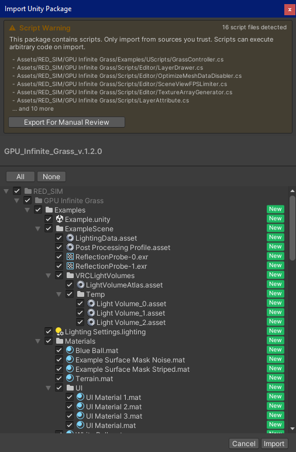

### Installation
- [Add To VCC/ALCOM](https://elianel.github.io/vcc-package-listing/) or [Download Release](https://github.com/elianel/warden/releases/latest)

# Warden
- Adds a warning inside the Unity Package Import Wizard when a package you are importing contains scripts
- Let's you to conveniently export scripts somewhere on disk for manual review
- Tested on `2022.3.22f1`

Scripts can execute code on import and may contain malicious logic.  
For example, cosmetic assets (e.g., outfits downloaded from booth.pm) should not include scripts or assemblies unless explicitly intended.

### Credits
- [Harmony](https://github.com/pardeike/Harmony) ([MIT License](https://github.com/pardeike/Harmony?tab=MIT-1-ov-file#readme))
